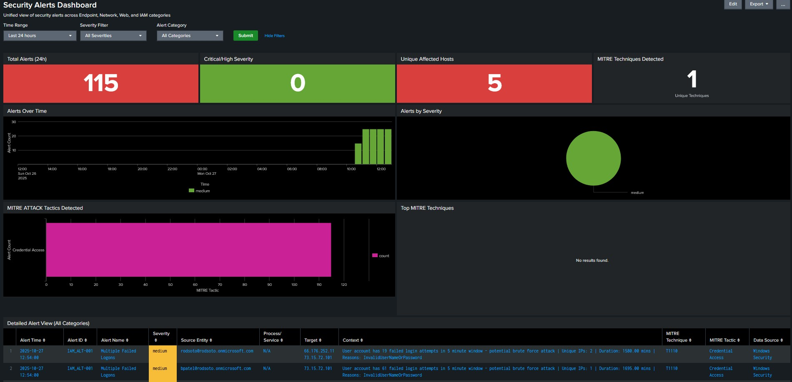

# Cyber Security Monitoring App - Documentation

## Overview

The **Cyber Security Monitoring App** is a custom Splunk application designed for security detection development and threat analysis. It provides a focused workspace for security analysts and detection engineers to build, test, and validate security use cases based on real-world attack techniques.

---

## Purpose

This application serves as a **detection engineering platform** that:

- Enables rapid development and testing of security detections without deploying to production
- Provides visibility into attack patterns using curated datasets from the Splunk Attack Data repository
- Maps security detections to the MITRE ATT&CK framework for comprehensive coverage tracking
- Offers a lightweight alternative to enterprise security platforms for use case development

**Note:** This app is not intended to replace comprehensive tools like Splunk Enterprise Security (ES), but rather complements them by providing a dedicated environment for detection content development.



---

## Architecture

### Data Flow

```
┌─────────────────────────────────────────────────────────────┐
│                    Raw Attack Data                          │
│              (attack_data index)                            │
│  - Sysmon logs                                              │
│  - Windows Security logs                                    │
│  - Network traffic                                          │
│  - Web logs                                                 │
└──────────────────────┬──────────────────────────────────────┘
                       │
                       ▼
┌─────────────────────────────────────────────────────────────┐
│              Scheduled Alert Searches                       │
│  - Run detection logic on raw data                          │
│  - Enrich with MITRE ATT&CK mapping                         │
│  - Normalize fields across data sources                     │
└──────────────────────┬──────────────────────────────────────┘
                       │
                       ▼
┌─────────────────────────────────────────────────────────────┐
│                  Notable Events                             │
│              (notable index)                                │
│  - Processed security alerts                                │
│  - Standardized field schema                                │
│  - MITRE ATT&CK enrichment                                  │
└──────────────────────┬──────────────────────────────────────┘
                       │
                       ▼
┌─────────────────────────────────────────────────────────────┐
│            Security Alerts Dashboard                        │
│  - Real-time alert visualization                            │
│  - MITRE ATT&CK coverage analysis                           │
│  - Alert triage and investigation                           │
└─────────────────────────────────────────────────────────────┘
```

### Key Components

#### 1. **Attack Data Repository**
- Source: [Splunk Attack Data GitHub Repository](https://github.com/splunk/attack_data)
- Contains curated datasets from various attack simulations
- Organized by MITRE ATT&CK technique IDs
- Ingested into the `attack_data` index

#### 2. **Detection Use Cases**
- Scheduled searches that run detection logic against raw data
- Each use case mapped to specific MITRE ATT&CK techniques
- Results written to the `notable` index for centralized alerting

#### 3. **Notable Events Index**
- Centralized repository for all security alerts
- Standardized field schema for cross-source correlation
- Enables fast dashboard queries and historical analysis

#### 4. **Security Alerts Dashboard**
- Single pane of glass for all security detections
- MITRE ATT&CK coverage visualization
- Alert filtering by severity, category, and time range

---

## Alert Classification System

Alerts are categorized using a structured naming convention:

| Prefix | Category | Description | Example |
|--------|----------|-------------|---------|
| **END** | Endpoint | Host-based detections (Sysmon, Windows Security) | END_ALT-001 |
| **NET** | Network | Network traffic analysis (Firewall, IDS/IPS) | NET_ALT-001 |
| **WEB** | Web | Web application and proxy logs | WEB_ALT-001 |
| **IAM** | Identity & Access | Authentication and authorization events | IAM_ALT-001 |

### Alert ID Format
`{CATEGORY}_ALT-{NUMBER}`

**Example:** `END_ALT-001` = Endpoint Alert #001

---

## Alert Metadata Schema

All alerts are enriched with the following metadata stored in the lookup file `iops_security_alerts_summary.csv`:

| Field | Description | Example |
|-------|-------------|---------|
| `alert_id` | Unique alert identifier | END_ALT-001 |
| `alert_name` | Descriptive alert name | Suspicious Registry Modification via Direct Device Access |
| `severity` | Alert severity level | critical, high, medium, low |
| `mitre_technique_id` | MITRE ATT&CK Technique ID | T1112 |
| `mitre_technique_name` | MITRE ATT&CK Technique Name | Modify Registry |
| `mitre_tactic` | MITRE ATT&CK Tactic | Defense Evasion |
| `data_source` | Source of alert data | Sysmon, Windows Security, Firewall |

---

## Notable Events Field Schema

All alerts written to the `notable` index use a standardized field structure:

### Core Fields
| Field | Description | Example |
|-------|-------------|---------|
| `_time` | Event timestamp | 2024-10-24 14:30:00 |
| `alert_id` | Alert identifier | END_ALT-001 |
| `alert_name` | Alert description | Suspicious Registry Modification |
| `severity` | Alert severity | medium |

### Normalized Fields (Cross-Source Compatible)
| Field | Description | Endpoint Example | Network Example |
|-------|-------------|------------------|-----------------|
| `src_entity` | Source host/IP | Computer name | Source IP address |
| `process_info` | Process/service details | Image path | Service name |
| `target_info` | Target object | Registry path | Destination IP |
| `additional_context` | Extra context | Suspicious reason | Protocol details |

### MITRE ATT&CK Fields
| Field | Description |
|-------|-------------|
| `mitre_technique_id` | MITRE Technique ID |
| `mitre_technique_name` | MITRE Technique Name |
| `mitre_tactic` | MITRE Tactic |

### Metadata Fields
| Field | Description |
|-------|-------------|
| `data_source` | Original data source |
| `source` | Alert ID (for filtering) |

---

## Current Detections

### Endpoint (END) Category

#### END_ALT-001: Suspicious Registry Modification via Direct Device Access
- **MITRE ATT&CK:** T1112 (Modify Registry)
- **Tactic:** Defense Evasion
- **Severity:** Medium
- **Data Source:** Sysmon EventCode 13
- **Detection Logic:** Identifies processes using the `\\?\` path prefix to access registry, which may indicate evasion techniques
- **Use Case:** Detects suspicious registry modifications that bypass normal path parsing

**Example Alert Fields:**
```
alert_id: END_ALT-001
alert_name: Suspicious Registry Modification via Direct Device Access
severity: medium
src_entity: WORKSTATION01
process_info: \\?\C:\Windows\system32\wbem\WMIADAP.EXE
target_info: HKLM\System\CurrentControlSet\Services\...
additional_context: Image path begins with \\?\ (direct device access) - potential evasion technique
mitre_technique_id: T1112
mitre_tactic: Defense Evasion
data_source: Sysmon
```

---

## Security Alerts Dashboard

The main dashboard provides comprehensive visibility into security alerts across all categories.

### Dashboard Features

#### 1. **Summary Statistics**
- Total alerts in selected time range
- Critical/High severity alert count
- Unique affected hosts
- MITRE techniques detected

#### 2. **Trend Visualizations**
- Alerts over time (by severity)
- Alert distribution by severity (pie chart)
- Alerts by source/type breakdown

#### 3. **MITRE ATT&CK Coverage**
- Tactics detected (bar chart)
- Top techniques table
- Coverage gap analysis

#### 4. **Detailed Alert View**
- Comprehensive alert table with all fields
- Color-coded severity indicators
- Sortable and filterable columns
- Drill-down capability for investigation

#### 5. **Summary Tables**
- Alert summary by category
- Top affected hosts
- Alert frequency analysis

### Dashboard Filters

| Filter | Options | Description |
|--------|---------|-------------|
| **Time Range** | Custom time picker | Filter alerts by time period |
| **Severity** | All, Critical, High, Medium, Low | Filter by alert severity |
| **Category** | All, END, NET, WEB, IAM | Filter by alert category |

---

## Setting Up Attack Data

### Prerequisites
- Git with Git LFS installed
- Python virtual environment (optional but recommended)
- Splunk instance with HEC enabled
- Test indexes created (`attack_data`, `notable`)

### Installation Steps

#### 1. Clone the Attack Data Repository
```bash
git lfs install
git clone https://github.com/splunk/attack_data
cd attack_data
```

#### 2. Pull Specific Datasets
```bash
# Pull a single technique dataset
git lfs pull --include="datasets/attack_techniques/T1003.001/atomic_red_team/"

# Or pull a specific log file
git lfs pull --include="datasets/attack_techniques/T1003.001/atomic_red_team/windows-sysmon.log"
```

#### 3. Ingest Data into Splunk

**Option A: Manual Upload (Recommended for Testing)**
1. Navigate to Splunk Web → Settings → Add Data → Upload
2. Select the downloaded log file
3. Set appropriate sourcetype (e.g., `XmlWinEventLog:Microsoft-Windows-Sysmon/Operational`)
4. Choose destination index (`attack_data`)
5. Submit

**Option B: Automated Replay Script**
1. Configure static variables in `replay_custom.py`:
   ```python
   SPLUNK_HOST = "your-splunk-server"
   SPLUNK_HEC_TOKEN = "your-hec-token"
   ```
2. Run the script:
   ```bash
   python replay_custom.py datasets/attack_techniques/T1003.001/atomic_red_team/atomic_red_team.yml
   ```
3. Answer prompts for index, source, and sourcetype

---

## Creating New Detection Use Cases

### Step 1: Develop Detection Logic

Create a search that identifies suspicious activity in your attack data:

```spl
index=attack_data 
source="XmlWinEventLog:Microsoft-Windows-Sysmon/Operational" 
EventCode=1
CommandLine="*powershell*-enc*"
earliest=-1h latest=now
| eval alert_name="Suspicious Encoded PowerShell Execution"
| eval suspicious_reason="PowerShell executed with encoded command - potential malware execution"
| eval alert_time=strftime(_time, "%Y-%m-%d %H:%M:%S")
| eval src_entity=coalesce(Computer, host)
| eval process_info=coalesce(Image, "N/A")
| eval target_info=coalesce(CommandLine, "N/A")
| eval additional_context=suspicious_reason
| table _time, alert_name, src_entity, process_info, target_info, additional_context
```

### Step 2: Add Alert to Lookup File

Add a new row to `iops_security_alerts_summary.csv`:

```csv
END_ALT-002,Suspicious Encoded PowerShell Execution,high,T1059.001,PowerShell,Execution,Sysmon
```

### Step 3: Create Scheduled Alert

1. Save the search as an alert
2. Configure schedule (e.g., every 5 minutes)
3. Add the lookup enrichment:
   ```spl
   | lookup iops_security_alerts_summary alert_name OUTPUT alert_id, data_source, mitre_tactic, mitre_technique_id, mitre_technique_name, severity
   ```
4. Add the `collect` command to write to `notable` index:
   ```spl
   | collect index=notable sourcetype=notable_events
   ```

### Step 4: Test and Validate

1. Run the alert manually to verify results
2. Check the `notable` index for alert data:
   ```spl
   index=notable source="END_ALT-002" earliest=-1h
   ```
3. Verify alert appears in the Security Alerts Dashboard
4. Validate MITRE ATT&CK mapping is correct

---

## Alert Template

Use this template for creating new alerts:

```spl
index=attack_data 
source="<YOUR_SOURCE>"
<DETECTION_LOGIC_HERE>
earliest=-1h latest=now
| eval alert_name="<DESCRIPTIVE_ALERT_NAME>"
| eval suspicious_reason="<WHY_THIS_IS_SUSPICIOUS>"
| eval alert_time=strftime(_time, "%Y-%m-%d %H:%M:%S")
| lookup iops_security_alerts_summary alert_name OUTPUT alert_id, data_source, mitre_tactic, mitre_technique_id, mitre_technique_name, severity
| eval src_entity=coalesce(<SOURCE_FIELDS>, host)
| eval process_info=coalesce(<PROCESS_FIELDS>, "N/A")
| eval target_info=coalesce(<TARGET_FIELDS>, "N/A")
| eval additional_context=suspicious_reason
| table _time, alert_id, alert_name, severity, src_entity, process_info, target_info, additional_context, mitre_technique_id, mitre_tactic, data_source
| collect index=notable sourcetype=notable_events
```

---

## Best Practices

### Detection Development
1. **Start with Raw Data Analysis**
   - Understand the data structure before writing detections
   - Use `| table *` to see all available fields
   - Identify key indicators of compromise

2. **Test in Isolation**
   - Validate detection logic against known true positives
   - Check for false positives using benign data
   - Tune thresholds and filters as needed

3. **Use Normalized Fields**
   - Always populate `src_entity`, `process_info`, `target_info`, `additional_context`
   - Ensures dashboard compatibility across all alert types
   - Enables cross-source correlation

4. **MITRE ATT&CK Mapping**
   - Map every alert to at least one MITRE technique
   - Document the tactic(s) the technique belongs to
   - Track coverage gaps in your detection strategy

### Alert Management
1. **Consistent Naming**
   - Use descriptive alert names
   - Follow the category prefix convention (END/NET/WEB/IAM)
   - Keep alert IDs sequential within categories

2. **Severity Assignment**
   - **Critical:** Immediate response required, high confidence of compromise
   - **High:** Likely malicious activity, requires investigation
   - **Medium:** Suspicious activity, context-dependent threat
   - **Low:** Anomalous behavior, informational

3. **Documentation**
   - Document detection logic and assumptions
   - Include example scenarios and expected false positive rate
   - Link to relevant MITRE ATT&CK techniques and threat intelligence

### Performance Optimization
1. **Alert Frequency**
   - Run high-confidence alerts more frequently (5-15 minutes)
   - Run noisy/low-severity alerts less frequently (1 hour)
   - Balance detection speed with system load

2. **Data Retention**
   - Set appropriate retention for `notable` index based on compliance requirements
   - Archive old alerts for historical analysis
   - Consider summary indexing for long-term trending

3. **Dashboard Performance**
   - Dashboard queries are fast since they only read from `notable` index
   - Avoid complex searches in dashboard panels
   - Use appropriate time ranges (default: 24 hours)

---

## Troubleshooting

### Issue: Alerts Not Appearing in Dashboard

**Possible Causes:**
1. Alert not writing to `notable` index
2. Time range filter excluding alerts
3. Severity or category filter excluding alerts

**Solutions:**
```spl
# Check if alerts exist in notable index
index=notable earliest=-24h | stats count by source

# Check specific alert
index=notable source="END_ALT-001" earliest=-24h | table _time, *

# Verify field population
index=notable earliest=-24h | table alert_id, alert_name, severity, src_entity
```

### Issue: Missing MITRE ATT&CK Mapping

**Possible Causes:**
1. Lookup file not updated
2. `alert_name` mismatch between SPL and lookup
3. Lookup not being applied in alert search

**Solutions:**
```spl
# Test lookup manually
| makeresults 
| eval alert_name="Suspicious Registry Modification via Direct Device Access"
| lookup iops_security_alerts_summary alert_name OUTPUT alert_id, mitre_technique_id

# Verify lookup file contents
| inputlookup iops_security_alerts_summary

# Check for exact name match (case-sensitive)
index=notable | stats count by alert_name
```

### Issue: Dashboard Panels Not Loading

**Possible Causes:**
1. Field names mismatch
2. No data in selected time range
3. Search syntax errors

**Solutions:**
```spl
# Verify notable index schema
index=notable earliest=-24h | head 1 | table *

# Check for required fields
index=notable earliest=-24h 
| stats count by alert_id, severity, mitre_technique_id

# Simplify search to isolate issue
index=notable | stats count
```

---

## Future Enhancements

### Planned Features
- [ ] Alert triage workflow (status field: open/investigating/closed)
- [ ] Automated response actions
- [ ] Threat intelligence integration
- [ ] Risk-based alerting and scoring
- [ ] Alert correlation across multiple techniques
- [ ] Custom MITRE ATT&CK navigator export
- [ ] Scheduled email reports
- [ ] Integration with ticketing systems (JIRA, ServiceNow)

### Detection Coverage Expansion
- [ ] Network-based detections (NET category)
- [ ] Web application security (WEB category)
- [ ] Identity and access management (IAM category)
- [ ] Cloud security detections
- [ ] Container and Kubernetes security

---

## References

### MITRE ATT&CK Framework
- **Website:** https://attack.mitre.org
- **Navigator:** https://mitre-attack.github.io/attack-navigator/
- **Documentation:** https://attack.mitre.org/resources/

### Splunk Attack Data
- **Repository:** https://github.com/splunk/attack_data
- **Documentation:** https://github.com/splunk/attack_data/blob/master/README.md

### Splunk Security Content
- **Repository:** https://github.com/splunk/security_content
- **Detections Library:** https://research.splunk.com

### Additional Resources
- **Splunk Docs:** https://docs.splunk.com
- **Splunk Community:** https://community.splunk.com
- **Security Content Blog:** https://www.splunk.com/en_us/blog/security.html

---

## Support and Contribution

This is a custom application developed for internal use. For questions, suggestions, or contributions:

1. Document any new detection use cases you develop
2. Share MITRE ATT&CK coverage gaps you identify
3. Report any bugs or performance issues
4. Suggest enhancements or new features

---

## Version History

### v1.0.0 (Initial Release)
- Core dashboard with multi-panel visualization
- Notable events framework
- MITRE ATT&CK mapping via lookup
- Endpoint detection category (END)
- First detection: END_ALT-001 (Suspicious Registry Modification)
- Attack data ingestion workflow
- Custom replay script for automated data ingestion

---

## License

This application is for internal use only. Attack data sourced from the Splunk Attack Data repository is licensed under Apache 2.0.

---

**Document Version:** 1.0  
**Last Updated:** October 2024  
**Author:** Security Engineering Team
